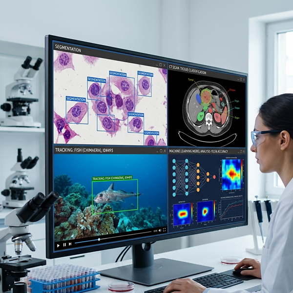

<h1>Mini Course: Computer Vision and Machine Learning for Scientific Visual Data Analytics</h1>

<h3>by <a href="https://aimerykong.github.io/" target="_blank" rel="noopener noreferrer">Shu Kong</a></h3>

This repository hosts teaching materials for the mini course at [OIST](https://groups.oist.jp/grad/event/mini-course-computer-vision-and-machine-learning-scientific-visual-data-analytics-0).
This course introduces computational techniques of Computer Vision and Machine Learning (CV/ML) to scientific visual data analysis. Scientific visual data can be CT scans, microscope imagery, remove sensing imagery, videos captured from camera trap, etc. The course focuses on CV/ML techniques and briefly introduces their applications in palynology, ecology and marine science. 
Furthermore, the course contains hands-on programming exercises to solidify students’ knowledge and skills learned from this course, covering the above topics. The course will use Google Colab as the programming environment and provide step-by-step configurations. The data used in the course is mainly microscope scans of pollen data but students are encouraged to bring in their own scientific visual data to test algorithms and discuss potential use cases with the instructor.

## Syllabus
The syllabus of this course is as follows.

## Time and Venue
The course will take place at B700 Grad School, 10:00-12:00, Monday & Wednesday, from June 29 to July 27 (except on July 20 which is a public holiday)

## Materials

- Jupyter Notebook files are for hands-on coding. They can be imported to Google Colab, which will be used in this course.
- Each Jupyter Notebook file contains implementation details and comments. Refer to them when running the notebooks.
- Datasets used in this course are included in the **datasets** folder.
- Finalized slides in pdf will be uploaded to the **slides** folder after this course (by the August 1st, 2026). 

## Contact
Regarding the short course, contact the instructor [Shu Kong](https://aimerykong.github.io/) via shu.kong@oist.jp or aimerykong@gmail.com with a subject line "*mini course at OIST*"
